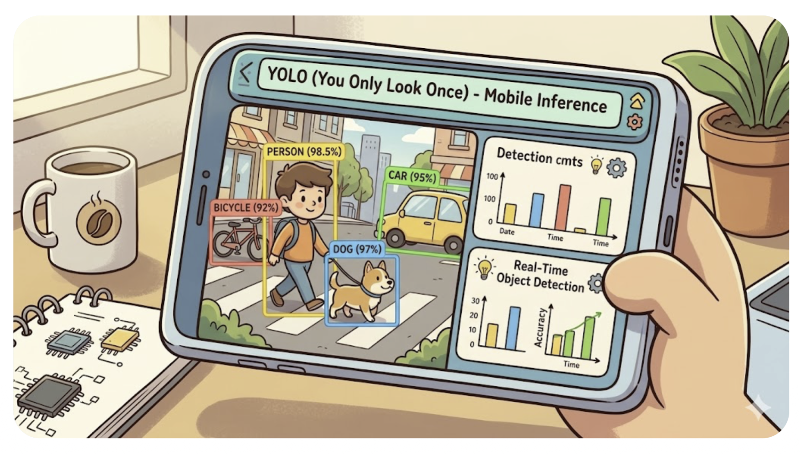
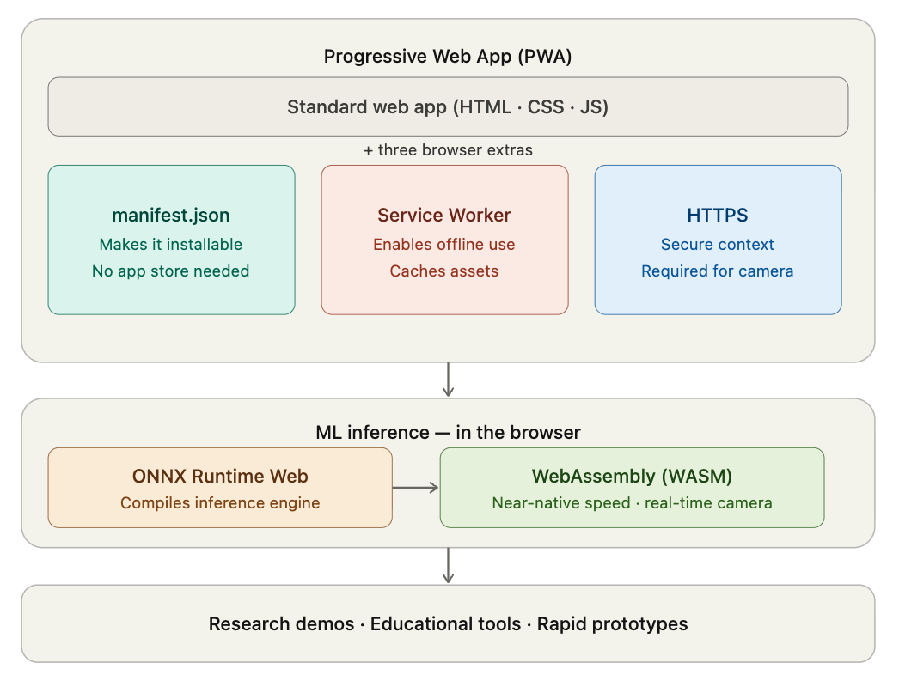
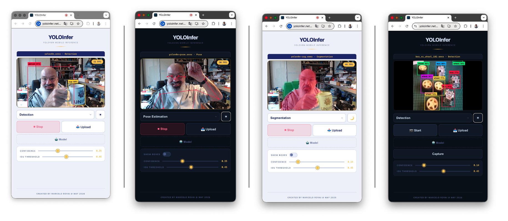
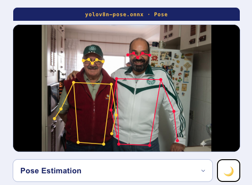
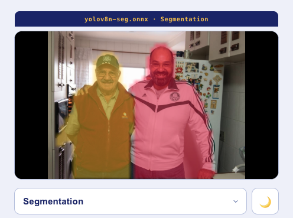
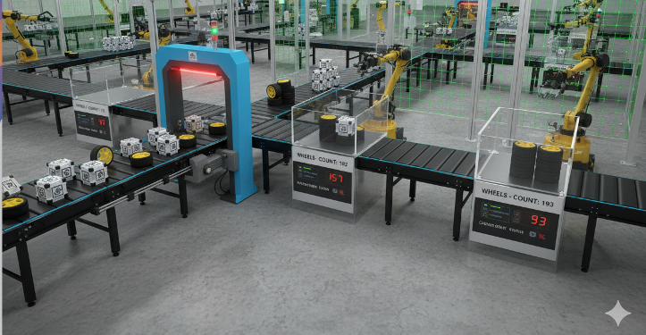
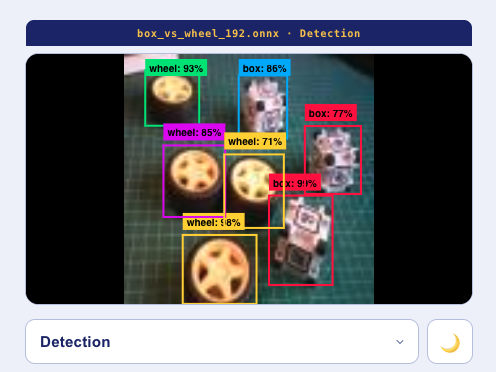

# YOLOInfer - Mobile YOLO Inference

Running YOLO on Your Phone — No App Store Required



### Building a Real-Time Inference PWA with ONNX Runtime Web

> **What you'll learn:** How to deploy a YOLOv8 model directly in the browser, why Progressive Web Apps are a compelling choice for mobile ML demos, and how the YOLOInfer project is wired together from camera input to detection overlay.

---

## The Idea

You trained a YOLO model. It works great on your laptop or on an edge device like the Raspberry Pi. Now you want to show it running on a phone — at a conference, in a classroom, in a farm, in a factory. What are your options?

The obvious answer is "build an app." But that means navigating the App Store review process, managing separate iOS and Android codebases (at least), or learning a cross-platform framework. For a research demo or educational project, that overhead is often the bottleneck that kills the project.

There is another way: **ship it as a web app that runs entirely in the browser.** The model runs on-device via [WebAssembly](https://en.wikipedia.org/wiki/WebAssembly). The camera is accessed through the browser's `getUserMedia` API. No server, no app review, no install — just a URL.

That's what ***YOLOInfer*** does. It runs YOLOv8n Detection, Pose Estimation, and Segmentation models in real time, directly in a mobile browser, packaged as a Progressive Web App (PWA) that can be installed to the home screen.

> This tutorial explains why this approach works, where it falls short, and exactly how the project is built.
>

---

## Part 1: Mobile App Development — Your Options

When you want to put an ML model on a phone, you have three main paths.

### Native Apps (Swift / Kotlin)

Native apps give you the best performance and full hardware access. On iOS, you can use Core ML; on Android, you can use TensorFlow Lite or ONNX Runtime Mobile. The result feels like a first-class product.

The cost: you write the same app twice (or hire people who can), you wait for App Store review (days to weeks), and every update goes through that same process. For a research prototype, this is rarely the right tradeoff.

### Cross-Platform (React Native / Flutter)

Frameworks like React Native and Flutter let you write one codebase and ship to both platforms. Performance is good — near-native in most cases. ML integration is possible through native modules.

You still need App Store distribution, which means review delays and platform policies. You also add framework overhead and complexity. Better than native for team projects, but still heavyweight for demos.

### Progressive Web Apps (PWA)



A [PWA](https://en.wikipedia.org/wiki/Progressive_web_app) is a web app with three extras: a `manifest.json` (makes it installable), a **Service Worker** (enables offline and caching), and **HTTPS** (required for camera access). Users can add it to their home screen from the browser — no App Store involved.

For ML inference, the browser now has a path to real performance: **WebAssembly (WASM)**. ONNX Runtime Web compiles the inference engine to WASM and runs models at speeds that, for small models like YOLOv8n, are fast enough for real-time camera use.

The tradeoffs are real. But for research demos, educational tools, and rapid prototypes, the PWA approach is hard to beat.

---

## Part 2: The PWA Approach — Advantages and Limitations

### What Makes a PWA

Three files do most of the work:

**`manifest.json`** — Tells the browser how to present the app when installed:

```json
{
  "name": "YOLOInfer",
  "short_name": "YOLOInfer",
  "display": "fullscreen",
  "orientation": "any",
  "background_color": "#060d18",
  "theme_color": "#060d18",
  "icons": [
    { "src": "/icons/icon-192.png", "sizes": "192x192" },
    { "src": "/icons/icon-512.png", "sizes": "512x512" }
  ]
}
```

**`sw.js`** — The Service Worker intercepts network requests and serves from cache. For an ML app, this matters a lot: ONNX models are 12–15 MB each, and <u>you don't want to re-download them on every visit:</u>

```javascript
// Cache-first for models and WASM — these never change
const CACHE_FIRST = ['/models/', '.wasm'];

self.addEventListener('fetch', event => {
  const url = new URL(event.request.url);
  const isCacheFirst = CACHE_FIRST.some(p => url.pathname.includes(p));

  if (isCacheFirst) {
    event.respondWith(
      caches.match(event.request).then(cached =>
        cached || fetch(event.request).then(resp => {
          const clone = resp.clone();
          caches.open('yoloinfer-v1').then(c => c.put(event.request, clone));
          return resp;
        })
      )
    );
  }
});
```

**HTTPS** — Required for camera access (`getUserMedia`). Netlify provides this automatically.

### Advantages for ML Demos

| Advantage | What it means in practice |
|-----------|--------------------------|
| Zero install friction | Share a URL. Done. |
| Instant updates | Deploy to Netlify; everyone gets the new version on their next visit. |
| Works on iOS and Android | One codebase, all devices. |
| No App Store review | Ship at research speed, not App Store speed. |
| On-device inference | Model runs locally — no server cost, no latency, no privacy concern. |
| Models cached after first load | 12 MB model loads once, then runs offline. |

### Known Limitations

**iOS camera requires HTTPS and a real domain.** `getUserMedia` is blocked on `http://` and on `localhost` in some iOS versions. Use a tool like Vite's `basicSsl` plugin during development, and HTTPS in production.

**iOS file picker shows a 3-option action sheet.** When a user taps "Model" to load a custom `.onnx` file, iOS shows a sheet with "Photo Library / Camera / Files." This is an Apple system decision — the web cannot suppress it. The user must tap "Files" to reach the ONNX file. On desktop Chrome and Edge, the app uses the `showOpenFilePicker` API for a direct, filtered file dialog.

**WASM is single-threaded by default.** ONNX Runtime Web supports WASM SIMD for better performance, but multi-threading requires specific HTTP headers (`Cross-Origin-Opener-Policy`, `Cross-Origin-Embedder-Policy`) that break some hosting setups. 

> YOLOInfer runs single-threaded and gets ~25–30 FPS on a modern iPhone with YOLOv8n (192x192).

**No background execution.** A PWA cannot run inference in the background. The screen must be on and the browser tab active.

**Service Worker caching during development is a trap.** The service worker caches aggressively. During development, use hard refresh (`Cmd+Shift+R`) or an incognito window. On mobile: incognito or "hold the reload gesture."

---

## Part 3: The YOLOInfer Project



### Tech Stack

```
Vanilla JS + Vite     — no framework, minimal bundle
ONNX Runtime Web      — WASM inference engine
Vite basicSsl plugin  — HTTPS for dev camera access
Netlify               — hosting + automatic HTTPS
```

No React, no Vue, no Angular. The project is deliberately minimal — the inference pipeline and the camera loop are the interesting parts. A framework would add complexity without adding capability.

### Project Structure

```
YOLOInfer/
├── src/
│   ├── main.js          ← UI state machine, camera, canvas, render loop
│   ├── inference.js     ← model loading, preprocessing, NMS, postprocessing
│   └── style.css        ← dark "lab instrument" theme
├── public/
│   ├── sw.js            ← service worker (cache-first for models/wasm)
│   ├── manifest.json    ← PWA manifest
│   ├── models/          ← .onnx model files (served as static assets)
│   │   ├── yolov8n.onnx
│   │   ├── yolov8n-pose.onnx
│   │   ├── yolov8n-seg.onnx
│   │   └── box_vs_wheel_192.onnx # Custom model - Can be upload later
│   └── icons/           ← PWA icons
├── index.html
├── vite.config.js
└── netlify.toml
```

---

## Part 4: The Inference Pipeline

This is the core of the project. Understanding it requires understanding what YOLO actually outputs and how to convert it into bounding boxes on the screen.

### What YOLOv8n Does

YOLO (You Only Look Once) is a family of object detection models. The "n" in YOLOv8n stands for "nano" — the smallest, fastest variant, designed for embedded and mobile deployment.

A single forward pass through YOLOv8n on a 192×192 input image produces a tensor containing candidate bounding boxes for every object it might have seen. Your job is to filter those candidates into actual detections.

YOLOInfer supports three model types:

| Type | What it detects | Output shape |
|------|----------------|-------------|
| Detection | Bounding boxes + class | `[1, 4+C, 756]` |
| Pose Estimation | Bounding boxes + 17 keypoints | `[1, 56, 756]` |
| Segmentation | Bounding boxes + pixel masks | `[1, 116, 756]` + `[1, 32, 48, 48]` |

In all cases, the `756` dimension means 756 candidate boxes. Most are filtered out; a real scene typically yields 1–20 final detections.

### Input Preprocessing

Before inference, the camera frame (or uploaded image) must be resized to `192×192` and converted to a normalized float tensor.

> A 192×192 image size was chosen because it runs smoothly on mobile devices and small edge devices, such as Arduino Uno-Q, Raspberry Pi Zero, XIAO Vision Camera, and XIAO ESP32S3 Sense.

YOLOInfer uses two preprocessing modes depending on the model:

**Letterbox** — Scale the frame to fit within 192×192 while preserving aspect ratio. Pad the short axis with black. Used for all standard Ultralytics exports (pose, segmentation, standard detection):

```
Camera frame: 1280×720 (landscape)
Scale to fit 192×192: scale = 192/720 ≈ 0.267
Scaled size: 341×192 → too wide
Scale by width: scale = 192/1280 = 0.15
Scaled size: 192×108
PadY = (192-108)/2 = 42px top and bottom
```

**Crop** — Take the largest centered square from the source, then scale to 192×192. Used for custom models trained with a centered-crop pipeline:

```javascript
// inference.js — letterbox preprocessing
export function preprocess(source) {
  const srcW = source.videoWidth || source.naturalWidth;
  const srcH = source.videoHeight || source.naturalHeight;
  const scale = Math.min(192 / srcW, 192 / srcH);
  const dW = Math.round(srcW * scale);
  const dH = Math.round(srcH * scale);
  const padX = Math.floor((192 - dW) / 2);
  const padY = Math.floor((192 - dH) / 2);

  // Draw to offscreen canvas, then read pixel data
  offscreen.width = 192;
  offscreen.height = 192;
  offCtx.fillStyle = '#000';
  offCtx.fillRect(0, 0, 192, 192);
  offCtx.drawImage(source, padX, padY, dW, dH);

  const pixels = offCtx.getImageData(0, 0, 192, 192).data;
  const input = new Float32Array(3 * 192 * 192);
  for (let i = 0; i < 192 * 192; i++) {
    input[i]               = pixels[i * 4]     / 255; // R
    input[i + 192*192]     = pixels[i * 4 + 1] / 255; // G
    input[i + 192*192*2]   = pixels[i * 4 + 2] / 255; // B
  }
  // Store state for coordinate back-transformation
  lastPreprocessState = { srcW, srcH, scale, padX, padY };
  return new ort.Tensor('float32', input, [1, 3, 192, 192]);
}
```

### Running Inference

```javascript
// main.js
async function doInference(source) {
  const input = inf.preprocess(source);
  const feeds = { [session.inputNames[0]]: input };
  const out = await session.run(feeds);
  // ...
}
```

`session.run()` is the ONNX Runtime call. It takes an object mapping input names to tensors and returns output tensors. The model's input is always `[1, 3, 192, 192]` (batch=1, RGB, 192×192).

### Postprocessing: Detection

The output tensor for detection has shape `[1, channels, 756]`:
- Channels 0–3: `cx, cy, w, h` (bounding box center + size)
- Channels 4+: one confidence score per class

```javascript
// inference.js
export function postprocessDetection(output, numBoxes, confThresh, iouThresh, coordScale) {
  const data = output.data;
  const channels = output.dims[1];
  const numClasses = channels - 4;
  const boxes = [];

  for (let b = 0; b < numBoxes; b++) {
    // Find the highest-scoring class for this box
    let maxConf = 0, classId = 0;
    for (let c = 0; c < numClasses; c++) {
      const conf = data[(4 + c) * numBoxes + b];
      if (conf > maxConf) { maxConf = conf; classId = c; }
    }
    if (maxConf < confThresh) continue;

    // Extract box coordinates (coordScale = 192 for normalized, 1 for pixel)
    const cx = data[0 * numBoxes + b] * coordScale;
    const cy = data[1 * numBoxes + b] * coordScale;
    const w  = data[2 * numBoxes + b] * coordScale;
    const h  = data[3 * numBoxes + b] * coordScale;

    boxes.push({ x1: cx-w/2, y1: cy-h/2, x2: cx+w/2, y2: cy+h/2,
                 conf: maxConf, classId, type: 'bbox' });
  }

  return nms(boxes, iouThresh);
}
```

### Non-Maximum Suppression (NMS)

The raw output contains hundreds of overlapping candidate boxes for the same object. NMS keeps only the best one per object:

1. Sort all boxes by confidence (highest first)
2. For each remaining box, remove any lower-confidence box that overlaps it by more than the IoU threshold
3. The IoU (Intersection over Union) threshold controls how aggressively duplicates are merged — lower = stricter

```javascript
function nms(boxes, iouThresh) {
  boxes.sort((a, b) => b.conf - a.conf);
  const keep = [];
  const suppressed = new Set();

  for (let i = 0; i < boxes.length; i++) {
    if (suppressed.has(i)) continue;
    keep.push(boxes[i]);
    for (let j = i + 1; j < boxes.length; j++) {
      if (iou(boxes[i], boxes[j]) > iouThresh) suppressed.add(j);
    }
  }
  return keep;
}
```

### Coordinate Back-Transformation

Model output coordinates are in the 192×192 preprocessed input space. To draw on the canvas, they need to be mapped back through the preprocessing (undo letterbox or crop) and then through the `object-fit: contain` display transform.

```javascript
// main.js
function toCanvasCoords(x, y) {
  const state = inf.getLastPreprocessState();
  const { srcW, srcH } = state;
  const canvasW = overlay.width;
  const canvasH = overlay.height;

  // Step 1: model space → source image space (undo letterbox)
  let srcX, srcY;
  if (state.scale !== undefined) {
    // Letterbox: subtract padding, divide by scale
    srcX = (x - state.padX) / state.scale;
    srcY = (y - state.padY) / state.scale;
  } else {
    // Crop: reverse the center-square crop
    srcX = state.sx + x * (state.sw / 192);
    srcY = state.sy + y * (state.sh / 192);
  }

  // Step 2: source image space → canvas (object-fit: contain)
  const srcAspect = srcW / srcH;
  const canvasAspect = canvasW / canvasH;
  let dW, dH, oX, oY;
  if (srcAspect > canvasAspect) {
    dW = canvasW; dH = canvasW / srcAspect;
  } else {
    dH = canvasH; dW = canvasH * srcAspect;
  }
  oX = (canvasW - dW) / 2;
  oY = (canvasH - dH) / 2;

  return { x: oX + srcX * (dW / srcW), y: oY + srcY * (dH / srcH) };
}
```

### Pose Estimation



Pose estimation adds 17 keypoints (COCO skeleton) to each detected person. The output shape is `[1, 56, 756]`:
- Channels 0–3: bounding box
- Channel 4: person confidence
- Channels 5–55: 17 × (x, y, visibility) keypoints

The skeleton connections:

```javascript
const kptPairs = [
  [0,1],[0,2],[1,3],[2,4],         // face
  [5,6],                            // shoulders
  [5,7],[6,8],[7,9],[8,10],        // arms
  [5,11],[6,12],[11,12],           // torso
  [11,13],[12,14],[13,15],[14,16], // legs
];
```

Keypoints with visibility confidence below 0.2 are skipped.

### Segmentation



Segmentation is the most complex output. Two tensors are produced:

- `output0 [1, 116, 756]` — bounding box + 80 class scores + 32 mask coefficients per detection
- `output1 [1, 32, 48, 48]` — 32 prototype masks (the mask "basis") at 48×48 resolution

For each detected object, the final mask is computed as:

```
mask = sigmoid(coefficients · prototypes)
```

That's a dot product of the 32 coefficients against the 32×48×48 prototypes, then sigmoid to get a 0–1 probability per pixel:

```javascript
// For each detection, compute its 48×48 mask
const mask = new Float32Array(48 * 48);
for (let px = 0; px < 48 * 48; px++) {
  let val = 0;
  for (let k = 0; k < 32; k++) {
    val += maskCoeffs[k] * protos[k * 48 * 48 + px];
  }
  mask[px] = 1 / (1 + Math.exp(-val)); // sigmoid
}
```

Pixels outside the detection bounding box are zeroed before sigmoid — otherwise `sigmoid(0) = 0.5 > 0.5 threshold` causes background bleed.

---

## Part 5: Auto-Detecting the Model Type

When a model file is loaded (whether a built-in or an uploaded custom model), the app doesn't rely on the user's dropdown selection to determine its type. Instead, it runs a **dummy inference** and inspects the output shape:

```javascript
// inference.js
export async function detectOutputConventions() {
  const dummy = new ort.Tensor('float32', new Float32Array(3*192*192), [1,3,192,192]);
  const out = await session.run({ [session.inputNames[0]]: dummy });
  const output = out[session.outputNames[0]];
  const channels = output.dims[1];

  // Two outputs → segmentation
  if (session.outputNames.length > 1) {
    return { type: 'segmentation', normalizedCoords: false, numClasses: channels - 4 - 32 };
  }

  // Pose: channels = 4 (bbox) + 1 (conf) + 17*3 (keypoints) = 56
  //   → impliedPoseClasses = 56 - 4 - 51 = 1 (between 1 and 5)
  const impliedPoseClasses = channels - 4 - 51;
  if (impliedPoseClasses >= 1 && impliedPoseClasses <= 5) {
    return { type: 'pose', normalizedCoords: false, numClasses: impliedPoseClasses };
  }

  // Detection: inspect actual output values to determine coordinate convention
  const vals = Array.from(output.data.slice(0, channels));
  const normalizedCoords = vals.some(v => v > 0 && v < 1);
  return { type: 'detection', normalizedCoords, numClasses: channels - 4 };
}
```

This is called after every model load and automatically configures preprocessing mode, class names, and coordinate scaling.

---

## Part 6: The Camera Loop

```javascript
// main.js — the real-time inference loop
async function runFrame() {
  if (!cameraRunning) return;
  if (inferenceRunning) {
    // Previous frame still processing — skip this tick
    rafId = requestAnimationFrame(runFrame);
    return;
  }

  inferenceRunning = true;
  const t0 = performance.now();

  const results = await doInference(video);
  drawResults(results);

  // Smooth FPS with exponential moving average
  if (lastInfStart > 0) {
    const dt = t0 - lastInfStart;
    fpsSmooth = fpsSmooth * 0.85 + (1000 / dt) * 0.15;
    fpsBadge.textContent = Math.round(fpsSmooth) + ' FPS';
  }
  lastInfStart = t0;

  inferenceRunning = false;
  if (cameraRunning) rafId = requestAnimationFrame(runFrame);
}
```

Key design decisions:

- **`requestAnimationFrame`** ties the loop to the display refresh rate (60fps cap) and pauses automatically when the tab is hidden.
- **`inferenceRunning` guard** prevents frame overlap — if inference takes longer than one frame (likely on slow devices), the loop skips rather than queuing.
- **Async/await** on `session.run()` — ONNX Runtime Web's inference is async (it can yield to the event loop during long computations, keeping the UI responsive).

The canvas overlay sits directly on top of the video element, both positioned `inset: 0` inside the viewport container. Detection annotations are drawn on the canvas while the video plays underneath.

---

## Part 7: Deployment

Deploying to [Netlify](https://www.netlify.com/) takes three steps after creating an account and linking your project.

### `netlify.toml`

```toml
[build]
  command = "npm run build"
  publish = "dist"

# Long-lived cache for model files (immutable by filename)
[[headers]]
  for = "/models/*"
  [headers.values]
    Cache-Control = "public, max-age=31536000, immutable"

# Security headers
[[headers]]
  for = "/*"
  [headers.values]
    X-Content-Type-Options = "nosniff"
    X-Frame-Options = "DENY"
```

The `Cache-Control: immutable` header on models tells the browser (and CDN) to never revalidate — the file will never change at that path. This means after the first visit, models load from the browser cache (near-instant).

### Deploy Command

```bash
npm run build            # builds to dist/
netlify deploy --prod --dir=dist
```

Netlify automatically provisions HTTPS, which is required for camera access on mobile browsers.

### Vite Configuration

```javascript
// vite.config.js
export default defineConfig({
  plugins: [ortWasmPlugin(), ...(isDev ? [basicSsl()] : [])],
  optimizeDeps: {
    exclude: ['onnxruntime-web'], // must not be pre-bundled — breaks WASM init
  },
  build: { target: 'es2020' },
  server: { host: true },  // LAN access for mobile testing
});
```

The `ortWasmPlugin` is a custom Vite plugin that serves `.wasm` files from `node_modules` during development. In production, WASM is loaded from the jsDelivr CDN (specified in `inference.js`).

---

## Part 8: Testing on Mobile

During development, Vite exposes the server on your local network (because of `server.host: true`). The terminal shows something like:

```
➜  Network: https://192.168.1.42:5173
```

Open that URL on your phone (accept the self-signed certificate warning). Camera access requires HTTPS — even on LAN — which is why `basicSsl()` is included as a dev-only plugin.

> **Hard refresh on mobile:** If the service worker is caching old code, open the app in incognito mode, or hold the pull-to-refresh gesture to force reload.

---

## Part 9: Real-World Performance

Tested on an iPhone 13 running iOS 17:

| Model | Resolution | FPS |
|-------|-----------|-----|
| YOLOv8n Detection | 192×192 | ~28 FPS |
| YOLOv8n Pose | 192×192 | ~25 FPS |
| YOLOv8n Segmentation | 192×192 | ~18 FPS |

Segmentation is slower due to the mask computation (a 48×48 matrix multiply for each detection).

The 192×192 input resolution is a deliberate choice for mobile — larger inputs (the default 640×640) would drop performance to single-digit FPS on a phone.

---

## Part 10: Using Custom Models

For example, let's use the [Custom Object Detection Project](https://mjrovai.github.io/EdgeML_Made_Ease_ebook/raspi/object_detection/custom_object_detection.html) in which an industrial facility must sort and count **wheels** and special **boxes**.



YOLOInfer accepts any YOLOv8 ONNX model exported with input shape `[1, 3, 192, 192]`. To export from Ultralytics:

```python
from ultralytics import YOLO

model = YOLO('best.pt')           # any official or custom-trained model
model.export(format='onnx', imgsz=192, simplify=True)
```

Once exported, tap the **Model** button in the app:
- **Desktop:** A file dialog opens, filtered to `.onnx` files
- **iOS:** Tap "Files" from the action sheet, then navigate to your `.onnx` file

The app auto-detects the model type, class count, and coordinate convention after loading.



---

## Recap

| Concern | Solution in YOLOInfer |
|---------|----------------------|
| ML runtime in browser | ONNX Runtime Web (WASM backend) |
| Camera access | `getUserMedia` API |
| HTTPS requirement | Vite `basicSsl` (dev) / Netlify (prod) |
| Model caching | Service Worker cache-first strategy |
| App install | PWA manifest + "Add to Home Screen" |
| Custom model support | `showOpenFilePicker` (desktop) / file input (mobile) |
| Multi-model support | Auto-detection via dummy inference |
| Coordinate alignment | Two-stage back-transform (preprocess → canvas) |

---

## Going Further

- **Train a custom model** — any YOLOv8 model exported to ONNX at 192×192 works. Replace the built-in models or upload via the Model button.
- **Larger models on desktop** — YOLOv8s or YOLOv8m at 320×320 are viable on a MacBook, even in the browser.
- **Add model management** — index multiple uploaded models in IndexedDB and let users switch between them without re-uploading.
- **Batch inference on images** — the same pipeline works on static images; extend the upload flow to process a folder.
- **Edge deployment without internet** — once the service worker has cached everything, YOLOInfer runs completely offline.

---

## Resourses 

The full source is at https://github.com/Mjrovai/yoloinferApp/tree/main/Code

The runing app can be accessed at [yoloinfer.netlify.app](https://yoloinfer.netlify.app)

---

*Built with Vanilla JS, Vite, ONNX Runtime Web, and Netlify. No framework. No server.*
